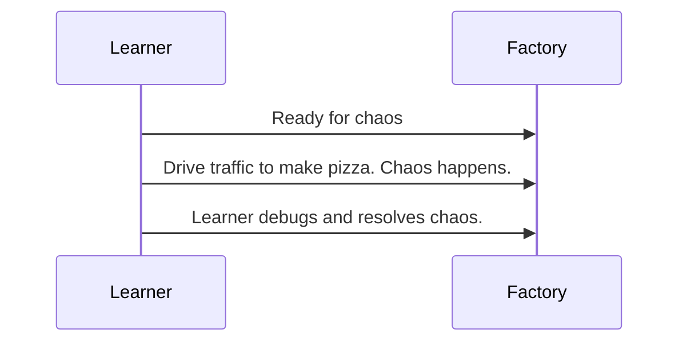

# 🍕 JWT Pizza Factory

The factory serves as the primary supporting service to all JWT Pizza vendors. It support pizza creation, JWT validation, Chaos testing, and Peer Vendor connections.

## Endpoints

You can get the documentation for all endpoints by making the following request.

```sh
curl $host/api/docs
```

## Backend

### Development notes

1. Create project
   ```sh
   mkdir backend && cd backend
   npm init
   ```
1. Install dependencies. Express gives us a wrapper for HTTP communication. node-jose helps us generate and validate our JWTs. UUID generates unique tokens for apiKeys. MySQL provides database support.
   ```sh
   npm install express node-jose mysql2 uuid
   ```
1. Key pairs are expected to be in the working directory. You can generate the keys with the following.

   ```sh
   ssh-keygen -t rsa -b 4096 -m PEM -f jwt.key
   openssl rsa -in jwt.key -pubout -outform PEM -out jwt.key.pub
   ```

1. Generate a secret you can use to sign a JWT
   ```js
   const k = require('crypto').randomBytes(64).toString('hex');
   console.log(k);
   ```

### JWT

A JWT Pizza is a JWT signed with an asymmetric key.

You can get the JWKS to verify JWTs using the `/.well-known/jwks.json` endpoint.

https://www.npmjs.com/package/node-jose

### Configuration

You must have a database available for use by the factory. You configure the connection to the database with a `config.js` file.

```js
const config = {
  db: {
    connection: {
      host: 'localhost',
      user: 'dbuser',
      password: 'toomanysecrets',
      database: 'pizza_factory',
      connectTimeout: 60000,
    },
  },
};

module.exports = config;
```

### Administrative auth token

The auth table must contain an authorization key that allows administrative requests. When the database is created for the first time, it will automatically create the token. You can manually read the value out of the database, or add other tokens.

```js
if (!dbExists) {
  const adminAuth = require('crypto').randomBytes(64).toString('hex');
  await connection.query(`INSERT INTO auth (token) VALUES (?)`, [adminAuth]);
}
```

All vendors are inserted through the admin endpoints.

## Using the factory

### Vendor access and Pizza creation

When a vendor is created they are assigned an apiKey. They can make order requests using that key. For example, the following orders a pizza using the apiKey `xyz`.

```sh
curl -X POST $host/api/order -H 'authorization: Bearer xyz' -d '{"diner":{"id":719,"name":"j","email":"j@jwt.com"},"order":{"items":[{"menuId":1,"description":"Veggie","price":0.0038}],"storeId":"5","franchiseId":4,"id":278}}' -H 'Content-Type: application/json'
```

## Chaos flow

The pizza factory supports injecting chaos in to the application.


