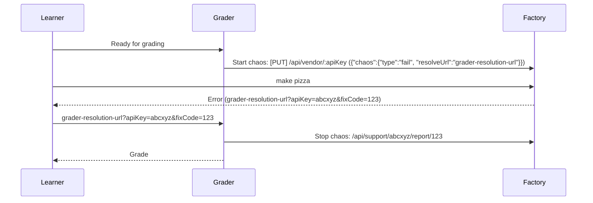

# 🍕 JWT Pizza Factory

Factory service for making JWT pizzas

## Usage

- Create an Admin endpoint to register JWT Pizza implementation this returns an API key for the JWT Pizza Server to use when making pizzas.

## Endpoints

You can get the documentation for all endpoints by making the following request.

```sh
curl $host/api/docs
```

## Chaos flow

The pizza factory supports injecting chaos in to the application as throttled requests, bad JWT tokens, or pizza creation failure.



## Development notes

1.  Initialize node.js
    ```sh
    npm init
    ```
1.  Install dependencies. Express gives us a wrapper for HTTP communication. node-jose helps us generate and validate our JWTs. UUID generates unique tokens for apiKeys. MySQL provides database support.
    ```sh
    npm install express node-jose mysql2 uuid
    ```
1.  Key pairs are expected to be in the working directory. You can generate the keys with the following.

    ```sh
    ssh-keygen -t rsa -b 4096 -m PEM -f jwt.key
    openssl rsa -in jwt.key -pubout -outform PEM -out jwt.key.pub
    ```

1.  Generate a secret you can use to sign a JWT
    ```js
    const k = require('crypto').randomBytes(64).toString('hex');
    console.log(k);
    ```

## JWT

A JWT Pizza is a JWT signed with an asymmetric key.

You can get the JWKS to verify JWTs using the `/.well-known/jwks.json` endpoint.

https://www.npmjs.com/package/node-jose

## Configuration

You must have a database available for use by the factory. You configure the connection to the database with a config file.

```js
const config = {
  db: {
    connection: {
      host: 'localhost',
      user: 'dbuser',
      password: 'toomanysecrets',
      database: 'pizza_factory',
      connectTimeout: 60000,
    },
  },
};

export default config;
```

Insert an administrative apiKey directly into the `auth` table of the database.

All vendors are inserted through the admin endpoints.
